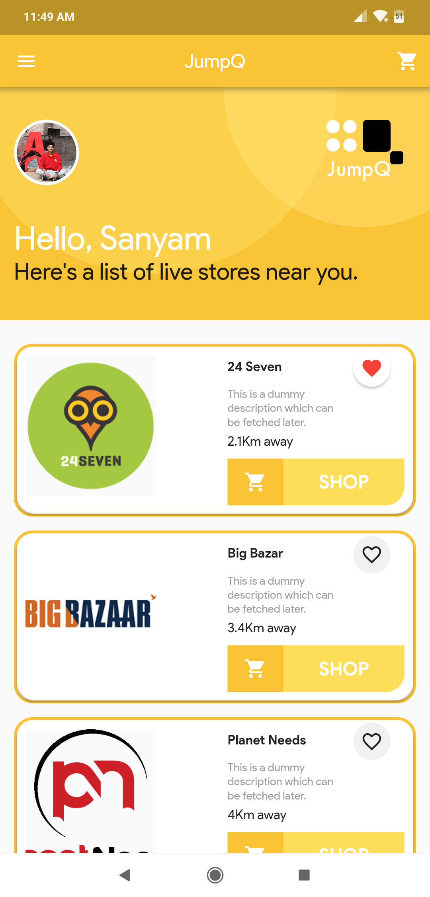
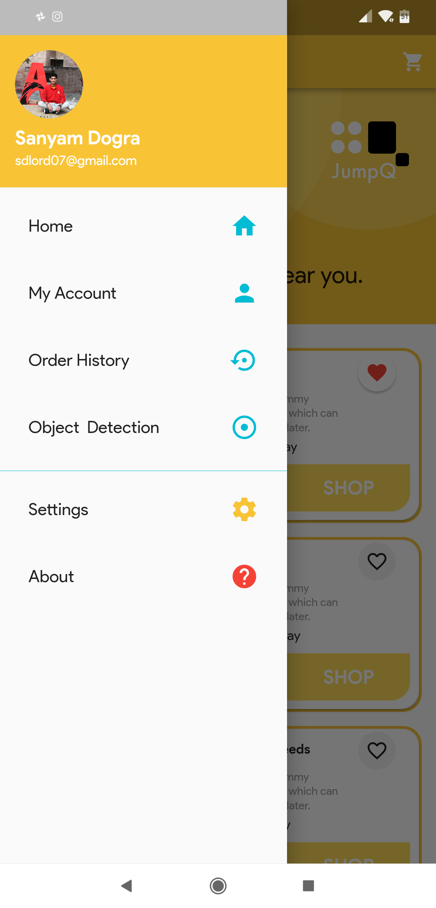
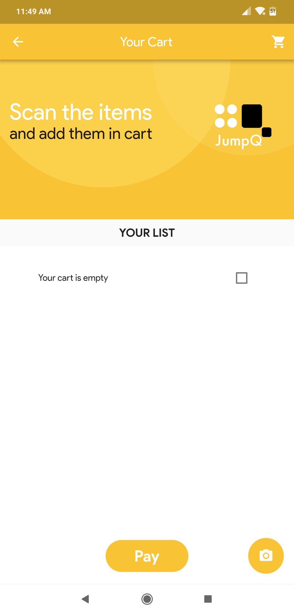
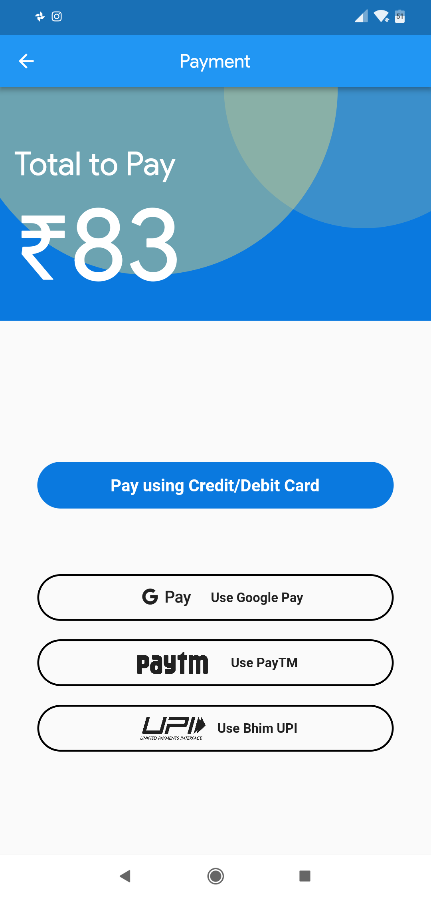
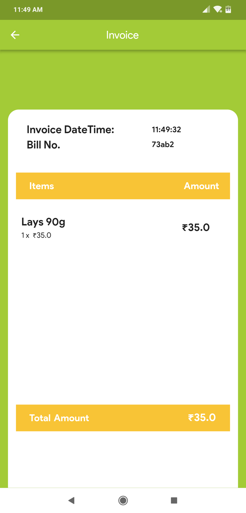

# JumpQ-SmartSolution

This app was made by me for Amity University's Hackathon.

## Made on Flutter

This project was made on flutter ie Google's latest SDK. Single code base will work for android and ios both.

## Sample Screenshots of the App

  
   
  
  
  

  
   

## If you like this app please give it a Star!

## Flutter resources

A few resources to get you started if this is your first Flutter project:

- [Lab: Write your first Flutter app](https://flutter.io/docs/get-started/codelab)
- [Cookbook: Useful Flutter samples](https://flutter.io/docs/cookbook)

For help getting started with Flutter, view our 
[online documentation](https://flutter.io/docs), which offers tutorials, 
samples, guidance on mobile development, and a full API reference.
